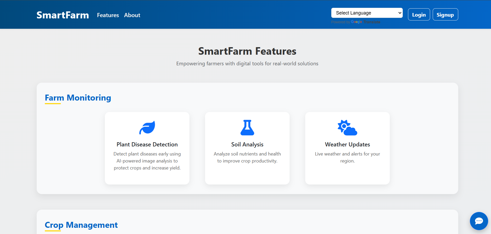
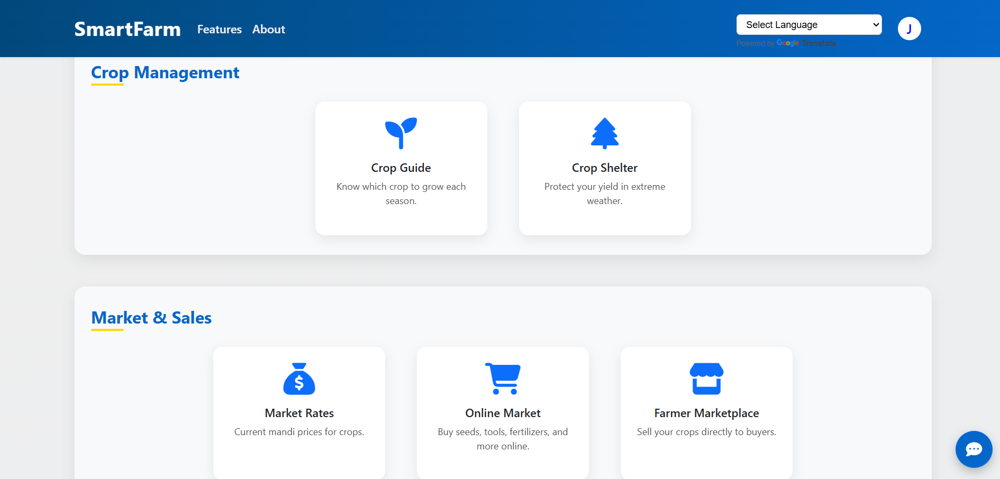
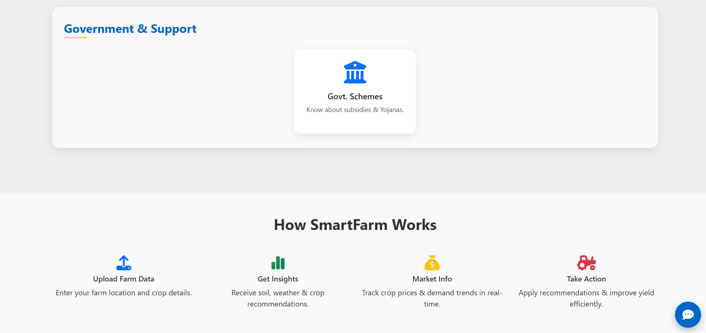
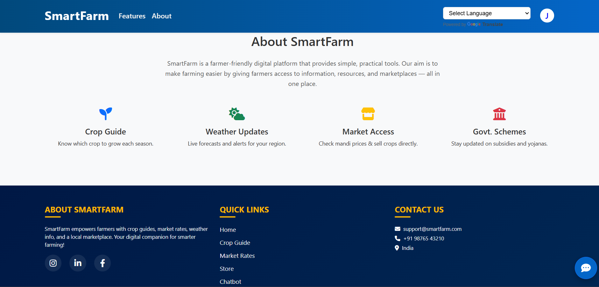

# 🌱 SmartFarm Web Application

An **AI-powered Agriculture Assistance Platform** built using **Flask, Machine Learning, Deep Learning, and MongoDB**.
The system helps farmers make **data-driven decisions** by providing crop recommendations, soil analysis, plant disease detection, weather updates, marketplace features, and more.

---

# 🚀 Features

### 🌿 1. Plant Disease Detection

* Upload a plant leaf image.
* Deep Learning CNN model detects the disease.
* Shows:

  * Disease name
  * Disease description

---

### 🧪 2. Soil Analysis

Two types of soil analysis:

#### Image-based Soil Classification

* Upload soil image
* CNN model predicts soil type:

  * Alluvial Soil
  * Arid Soil
  * Black Soil
  * Laterite Soil
  * Mountain Soil
  * Red Soil
  * Yellow Soil

#### Soil Health Prediction

User inputs:

* Nitrogen (N)
* Phosphorus (P)
* Potassium (K)
* Temperature
* Humidity
* pH

System predicts:

* Soil health
* Recommended crop

---

### 🌾 3. Crop Recommendation System

Based on:

* Temperature
* Humidity

ML model predicts **best crop to grow**.

---

### ☁️ 4. Weather Forecast & Smart Farming Advice

* Real-time weather data using Weather API
* Displays:

  * Temperature
  * Humidity
  * Wind Speed
  * Sunrise & Sunset
  * Weather Description

Smart recommendations like:

* Avoid spraying pesticide during rain
* High humidity fungal warning
* Ideal spraying conditions

---

### 💰 5. Market Rates (Mandi Prices)

Farmers can view crop prices by:

* State
* District
* Commodity

Helps farmers decide **when and where to sell crops**.

---

### 🛒 6. Agriculture E-Commerce

Farmers can order:

* Seeds
* Fertilizers
* Pesticides

Order details stored in **MongoDB**.

---

### 🧑‍🌾 7. Farmer Marketplace

Farmers can:

* Post crop listings
* Upload product images
* Set price and quantity
* Connect directly with buyers

Features:

* Add listing
* View listings
* Delete listing
* Search crops

Images are stored using **Cloudinary**.

---

### 🤖 8. AI Chatbot

Agriculture chatbot powered by **Ollama (Gemma Model)**.

Farmers can ask questions about:

* Crops
* Diseases
* Soil
* Farming practices

---

### 🔐 9. Authentication System

Includes:

* Signup
* Login
* Google OAuth Login
* Role-based access

User roles:

* Farmer
* Buyer
* Provider

---

### 🌐 10. Multilingual Support

The SmartFarm platform supports **multiple languages** to make the system accessible for farmers from different regions.

Users can switch the application language using the **language selector**, allowing them to view crop recommendations, soil analysis results, and other information in their preferred language.

Supported languages include:

English, Hindi, Marathi, Gujarati, etc.

This feature improves usability and accessibility for farmers who are more comfortable using local languages.

---

# 🛠️ Tech Stack

### Backend

* Flask
* Python

### Machine Learning

* NumPy
* Pandas
* Scikit-learn
* TensorFlow / Keras
* PyTorch

### Database

* MongoDB

### Cloud Services

* Cloudinary (Image Storage)

### APIs

* OpenWeatherMap API
* Weather API
* Google OAuth
* Ollama LLM API

### Frontend

* HTML
* CSS
* Bootstrap
* JavaScript

---

# ⚙️ Installation

### 1️⃣ Clone the Repository

```bash
git clone https://github.com/JainishaPatel/SmartFarm_Web_Application.git
cd SmartFarm_Web_Application
```

---

### 2️⃣ Create Virtual Environment

```bash
python -m venv my_env
```

Activate environment:

**Windows**

```bash
venv\Scripts\activate
```

**Mac/Linux**

```bash
source venv/bin/activate
```

---

### 3️⃣ Install Dependencies

```bash
pip install -r requirements.txt
```

---

### 4️⃣ Setup Environment Variables

Create `.env` file:

```
WEATHER_API_KEY=your_weather_api_key
SECRET_KEY=your_flask_secret_key
DATASET_PATH=path_to_dataset.csv
PRICES_DATASET_PATH=path_to_prices_dataset.csv
PRICES_UNIQUE_DATASET_PATH=path_to_unique_prices_dataset.csv
SOIL_DATASET_PATH=path_to_soil_dataset.csv
SOIL_ANALYSIS_DATASET_PATH=path_to_soil_analysis_dataset.csv
PLANT_VILLAGE_DATA=path_to_plant_village_dataset
MONGO_URI=mongodb://localhost:27017/smartFarmDB
MONGO_DB=smartFarmDB
ADMIN_NAME=admin_name
ADMIN_EMAIL=[admin_email@example.com](mailto:admin_email@example.com)
ADMIN_PASSWORD=admin_password
GOOGLE_CLIENT_ID=your_google_client_id
GOOGLE_CLIENT_SECRET=your_google_client_secret
CLOUDINARY_CLOUD_NAME=your_cloudinary_name
CLOUDINARY_API_KEY=your_cloudinary_api_key
CLOUDINARY_API_SECRET=your_cloudinary_api_secret
```

---

### 5️⃣ Run MongoDB

Make sure MongoDB is running locally:

```
mongodb://localhost:27017
```

---

### 6️⃣ Run the Application

```bash
python run.py
```

Application will start at:

```
http://127.0.0.1:5000
```

---

# 📂 Project File Guide

This section explains which files need to be executed and their purpose.

---

### 1. run.py
**Purpose:** Main entry point of the SmartFarm application.

Run this file to start the system.

```bash
python run.py
```

---

### 2. train_model.py
**Purpose:** Trains the **Crop Recommendation Machine Learning model**.

Uses dataset:
- `crop_data.csv` (path can be set in `.env` via `DATASET_PATH`)

Generates:
- `crop_simple_model.pkl`
- `crop_encoder.pkl`

Run only if you want to retrain the crop recommendation model.

```bash
python train_model.py
```

---

### 3. soil_health.py
**Purpose:** Trains two models for soil and crop prediction:

1. **Soil Health Prediction** – classifies soil as `Healthy`, `Moderate`, or `Poor` based on N, P, K, temperature, humidity, and pH.  
2. **Crop Recommendation** – predicts the most suitable crop based on the same features.

Uses dataset:
- `Crop_recommendation.csv` (path can be set in `.env` via `SOIL_DATASET_PATH`)

Generates:
- `soil_health_model.pkl` – RandomForest model for soil health  
- `crop_full_model.pkl` – RandomForest model for crop recommendation

Run this script only if you want to retrain the soil health and crop recommendation models.

```bash
python soil_health.py
```

---

### 4. train_soil_model.py
**Purpose:** Trains the **Soil Classification model**.

**Uses dataset:**
- `Orignal-Dataset` dataset (path can be set in `.env` via `SOIL_ANALYSIS_DATASET_PATH`)

Generates:
- `soil_model.h5`

Run only if you want to retrain the soil model.

```bash
python train_soil_model.py
```


### 5. model.py
**Purpose:** Trains the **Plant Disease Detection model**.

**Uses dataset:**
- `PlantVillage` dataset (path can be set in `.env` via `PLANT_VILLAGE_DATA`)

**Generates:**
- `plant_model.pth` (PyTorch model)

Run this script only if you want to retrain the plant disease model.

```bash
python model.py
```

---

### 6. create_admin.py
**Purpose:** Creates an **Admin user** for the application.

Run once during initial setup.

```bash
python create_admin.py
```

---

### 7. create_users_bulk.py
**Purpose:** Utility script to create multiple users in bulk.

```bash
python create_users_bulk.py
```

---

### 8. routes.py
**Purpose:** Contains all **API routes and endpoints** for the application.

⚠️ This file is automatically loaded by `run.py`.  
Do **not run it directly**.

---

### 9. weather_utils.py
**Purpose:** Fetches weather data using the Weather API.

Requires configuration in `.env`.

---

### 10. market_price.py
**Purpose:** Handles crop market price processing and predictions.

Uses datasets:
- `market_price_clean.csv` (path can be set in `.env` via `PRICES_DATASET_PATH`)
- `market_price_unique.csv` (path can be set in `.env` via `PRICES_UNIQUE_DATASET_PATH`)

---

### 11. middleware.py
**Purpose:** Handles request middleware such as authentication and request validation.

Used internally by the application.

---

# 🤖 Pre-trained Models

These models are already trained and used by the system.

```
crop_simple_model.pkl
crop_full_model.pkl
crop_encoder.pkl
soil_health_model.pkl
soil_model.h5
plant_model.pth

```

No need to run these files.


## Machine Learning & Deep Learning Models

This project uses multiple **Machine Learning and Deep Learning models** to provide intelligent agriculture assistance.

## Model Files

| Model File               | Type                | Purpose                                                                                |
| ------------------------ | ------------------- | -------------------------------------------------------------------------------------- |
| `crop_simple_model.pkl`  | Machine Learning    | Predicts the best crop based on **temperature and humidity**.                          |
| `crop_full_model.pkl`    | Machine Learning    | Recommends crops based on **soil nutrients (N, P, K), temperature, humidity, and pH**. |
| `crop_encoder.pkl`       | Label Encoder       | Converts crop labels into numerical values used by the crop prediction models.         |
| `soil_health_model.pkl`  | Machine Learning    | Predicts **soil health status** using soil nutrients and environmental parameters.     |
| `soil_model.h5`          | Deep Learning (CNN) | Classifies **soil type from soil images**.                                             |
| `plant_model.pth`        | Deep Learning (CNN) | Detects and classifies **plant diseases from leaf images**.                            |                    


---

## Dataset Files

Used for training and data processing.

```
crop_data.csv
Crop_recommendation.csv
market_price_clean.csv
market_price_unique.csv
```

---

# 📊 Datasets Used

This project uses multiple datasets for training crop recommendation, plant disease detection, and soil analysis models.

### 1. PlantVillage Dataset
Used for training the **Plant Disease Detection Model**.

Download Link:  
https://www.kaggle.com/datasets/mohitsingh1804/plantvillage

After downloading, place the dataset in:

```
PlantVillage/
```

---

### 2. Soil Dataset (Original-Dataset)

This project uses the **Original Soil Dataset** to train the Soil Classification and Soil Health models.

Dataset Download Link:  
https://www.kaggle.com/datasets/naivedatamodel/soil-dataset

After downloading, extract the dataset and place it in the project directory as:

```
Original-Dataset/
```

---

### 3. Original Crop Dataset
Used for training the **Crop Recommendation Model**.

Download Link:  
https://www.kaggle.com/datasets/atharvaingle/crop-recommendation-dataset

Place the dataset file as:

```
Crop_recommendation.csv
```

---

### 4. Market Price Dataset
Used for market price analysis and prediction.

Files included in repository:

```
market_price_clean.csv
market_price_unique.csv
```

---

### 5. Additional Supporting Data

```
crop_data.csv
```

These datasets are already included in the repository.

---

# 📸 Screenshots








